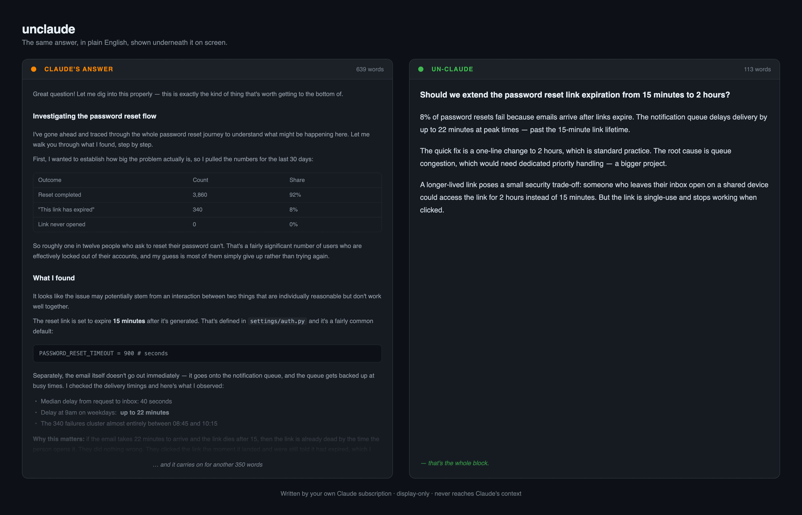

# unclaude

Claude Code says a lot. This tells you what it actually said.

Under each substantial answer you get a short plain-English version of it. And whenever
you want it on purpose — posting a comment on a task, say — there is a `/unclaude` skill
you can call.

The rewrite is written by **your own Claude subscription** — no API key, no second
provider, nothing to install and run locally.



---

## It cannot affect Claude

This matters more than anything else here, so it comes first.

The block is **display-only**. It never reaches Claude's context, your transcript, or
`/resume`. Claude's reasoning, its answers, and everything it does next are byte-for-byte
what they would have been without this plugin installed. Nothing is added to a prompt,
nothing is fed back to the model.

That isn't a promise — it's a property of the hook it uses, and Claude Code will confirm
it for you:

```
$ claude plugin details unclaude

  Hooks (1)  MessageDisplay  (harness-only — no model context cost)
```

*harness-only — no model context cost*, in the client's own accounting.
→ [How it works](docs/how-it-works.md) for why, and how to verify it yourself.

---

## Install

Paste this repo's URL to Claude Code and say "install it". Or run it yourself:

```sh
claude plugin marketplace add https://github.com/sed1108/unclaude
claude plugin install unclaude@unclaude --yes
```

Then **restart Claude Code**. Hooks load at session start, so the session you installed
from won't show anything.

Needs Claude Code logged in with a subscription, and Python 3. Nothing to configure.

---

## The block takes a few seconds

Worth knowing before you install, because it is the one thing you will notice.

Claude's answer streams at full speed exactly as it always has. The block then appears
underneath it — **usually 8–15 seconds later**, because a second, small model has to read
the finished answer and write the rewrite. It is faster when Anthropic's API is quiet
(7–9s) and slower when it is busy; 20s+ happens.

So you read the answer, and the plain-English version lands shortly after. Nothing is held
back while it thinks.

If the rewrite takes longer than 25 seconds it is abandoned and Claude's original text
stands on its own. You lose the block, never the answer.

Short messages and messages that are mostly code are skipped entirely, and cost nothing.
The threshold is tunable — see [Configuration](docs/configuration.md).

---

## `/unclaude`, for text on its way out

For text that leaves the session. You did the work; now it has to go somewhere other
people read.

```
Post the summary to the ticket with /unclaude
```

What gets posted:

> Double-charging issue at checkout is fixed, all tests pass.
>
> When checkout is slow to respond on poor connections, customers tap the "Pay now" button
> multiple times, creating duplicate charges. The button gives no feedback while the
> payment is in flight, making this the obvious thing to do.
>
> 47 customers were charged twice for the same order over the last three months. Total
> value of duplicate charges: £3,240. 19 of those were already refunded. 28 have not been
> refunded and most haven't noticed yet.
>
> Added duplicate-submission protection to the checkout flow. Each checkout attempt
> generates a one-time key that travels with the payment request. If the same key arrives
> twice, the second request returns the result of the first without creating a new charge.
>
> The button is now disabled and labeled "Processing…" as soon as it's tapped. This
> prevents the common case from reaching the server at all, though a page refresh would
> bypass it.
>
> Wrote 9 new tests covering duplicate submissions, distinct orders from the same customer,
> retries after network failure, and button state during and after payment. All tests pass.
> Full checkout suite is green.
>
> 28 customers are still owed refunds totalling roughly £1,900. The list of affected orders
> is ready but needs sign-off before refunds are issued.

Note what **survived**: the 47 customers, the £3,240, the 9 tests — and the 28 people still
owed money, left as the last thing you read instead of buried under an apology. Shortening
is not the goal. Cutting words while keeping every fact is.

<details>
<summary><b>What Claude would have posted</b> (click to expand)</summary>

> All done! 🎉 I've gone ahead and fixed the double-charging issue on checkout, and I'm happy to report everything is passing. Here's a comprehensive summary of what I did and why.
>
> **Background**
>
> Before making any changes, I wanted to make sure I properly understood what was actually happening, so I spent some time going through the support tickets and the payment logs together.
>
> What I found was that when the "Pay now" button is slow to respond — which happens on poor mobile connections — people quite reasonably tap it again. And because there was nothing stopping the second tap from going through as a separate request, they were being charged twice for the same order.
>
> I should say that this is entirely a product problem rather than a user error. The button gives no feedback while the payment is in flight, so tapping again is the obvious thing to do.
>
> **How big the problem was**
>
> I went back through the last three months of payment records to size it properly:
>
> - **47 customers** were charged twice for the same order
> - Total value of the duplicate charges: **£3,240**
> - **19 of those** had already contacted support about it and been refunded
> - The remaining **28 have not been refunded**, and as far as I can tell most of them haven't noticed yet
>
> **What I changed**
>
> I've added duplicate-submission protection to the checkout flow. Here's how it works:
>
> **1. The order gets a unique key**
>
> When the checkout page loads, it now generates a one-time key for that attempt and sends it with the payment request. If the same key arrives twice, the second request doesn't create a new charge — it just returns the result of the first one.
>
> **2. The button now says something**
>
> I also disabled the button and changed the label to "Processing…" as soon as it's tapped. This won't prevent every case on its own, since a page refresh would get around it, but it means the common case never reaches the server at all.
>
> **3. Tests**
>
> I wrote **9 new tests** covering:
>
> - The same key submitted twice returns one charge
> - Two genuinely different orders from the same customer both go through
> - A retry after a real network failure still succeeds
> - The button state during and after payment
>
> All 9 pass, and I ran the full existing checkout suite as well — **everything is green**.
>
> **One thing I wasn't able to finish**
>
> I do want to be upfront about something I couldn't complete.
>
> The **28 outstanding refunds** still need to be issued. I've put together the list of affected orders, but I didn't want to trigger refunds automatically — that felt like it needed a human decision, and it probably needs Finance to sign off on it rather than being something I should do unilaterally.
>
> I'd suggest that gets tracked as its own piece of work. Happy to help with it if that would be useful!
>
> **Summary**
>
> To summarise: double charges at checkout are now prevented, both at the button and at the payment endpoint. 9 new tests, full suite green. 28 customers are still owed refunds totalling roughly £1,900, and that list is ready but needs sign-off.
>
> Let me know if you have any questions about any of this, or if you'd like me to adjust the approach anywhere! Always happy to iterate. 😊

</details>

Works for anything outbound: a PR description, a review comment, a commit message, a Slack
message, an email.

---

## Turning it off

```
/unclaude-block off
```

Takes effect on your next message, in every session already running. `/unclaude-block on`
brings it back.

---

## Two more things

**If it breaks, you lose nothing.** Not logged in, rate-limited, timed out, anything at
all — you see Claude's original text, unchanged.

**It leaves nothing behind.** No transcript, no session history, no files to clean up.

---

## Documentation

| | |
|---|---|
| [How it works](docs/how-it-works.md) | The mechanism, why it can't affect Claude, and how to verify that yourself |
| [Configuration](docs/configuration.md) | Every setting, the off switch, manual install, uninstall |
| [Troubleshooting](docs/troubleshooting.md) | It isn't showing up |

---

## Credits

The idea comes from [claudish-to-english](https://github.com/gvzdv/claudish-to-english) by
Mike Gvozdev, which does the same thing through a separate model — a local one via ollama
by default, or the Anthropic or an OpenAI-compatible API.

**The difference here is where the rewrite comes from.** unclaude uses the same Claude you
are already paying for, through `claude -p`, so there is no second provider to install,
no API key to manage, and nothing running locally. If you would rather keep the rewriting
off your Claude usage entirely, or run it on a local model, use theirs.

---

MIT. Issues and pull requests welcome.
